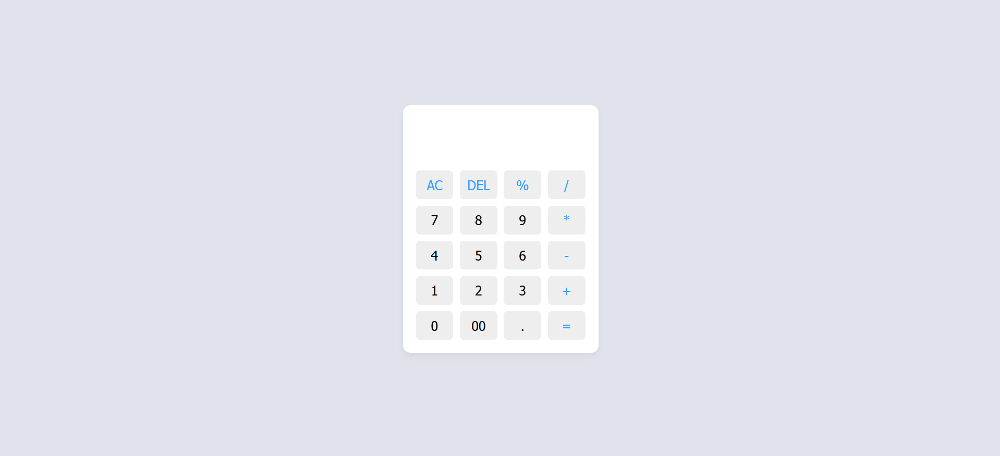

# Calculator

A simple and interactive calculator built using **HTML, CSS, and JavaScript**.

## Features

- Perform basic arithmetic operations: Addition, Subtraction, Multiplication, and Division.
- User-friendly and responsive design.
- Real-time display updates.

## Technologies Used

- **HTML** for structuring the calculator.
- **CSS** for styling and layout.
- **JavaScript** for handling calculations and user interactions.

## How to Use

1. Clone the repository:
   ```sh
   git clone https://github.com/Haji-Sharifi/Calculator.git
   ```
2. Navigate to the project folder:
   ```sh
   cd calculator
   ```
3. Open `index.html` in your browser.

## Preview

You can check out the live demo [here](https://2025calculator.vercel.app/)

## Screenshot



## Future Enhancements

- Implement advanced mathematical functions (e.g., square root, percentage, exponentiation).
- Add dark mode support.
- Improve keyboard support.

## Contributing

Feel free to fork this repository and submit pull requests for improvements!
